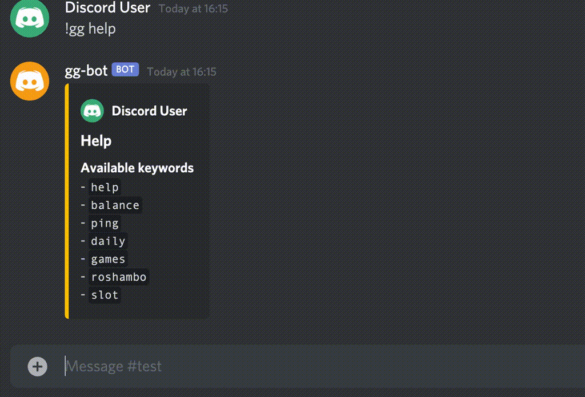

# GG Bot

[![Docker][gh_badge_docker]][gh_actions_docker]
[![Unit and Integration Tests][gh_badge_unit_integration]][gh_actions_unit_integration]

Discord bot to play games with.



## Documentation

- [Architecture](./docs/architecture.md)
- [Database Inspection](./docs/database-inspection.md)
- [Database Migrations](./docs/database-migrations.md)
- [Design Decisions](./docs/design-decisions.md)
- [Setup Instructions](./docs/setup-instructions.md)
- [Supported Games](./docs/supported-games.md)
- [Working with `bin` Scripts](./docs/working-with-bin-scripts.md)

## Run using Docker

```console
export SPRING_DATASOURCE_URL='jdbc:postgresql://database-container:5432/dbname'
export SPRING_DATASOURCE_USERNAME='spring_user'
export SPRING_DATASOURCE_PASSWORD='SpringUserPassword'

export POSTGRES_URL='jdbc:postgresql://localhost:5432'
export POSTGRES_DB='dbname'
export POSTGRES_USER='postgres'
export POSTGRES_PASSWORD='SuperuserPassword'

./bin/run.py --apply-migrations [--debug]
```

The application is now listening at `http://localhost:8080`. If the `--debug`
option has been used, the debugger is listening on port `8000`.

Configuration, such as network ports, Docker component names (volumes, network,
images, containers), can be adjusted inside
[./bin/config.ini](./bin/config.ini).

### Clean up

```console
./bin/teardown.py [--cache --db --network --tmp]
```

## Test

### Unit tests

```console
./gradlew test
```

### Integration tests

```console
./bin/integration_tests.py
```

[gh_actions_docker]:
  https://github.com/amrwc/gg-bot/actions/workflows/docker.yml
[gh_actions_unit_integration]:
  https://github.com/amrwc/gg-bot/actions/workflows/unit-and-integration-tests.yml
[gh_badge_docker]: https://github.com/amrwc/gg-bot/workflows/Docker/badge.svg
[gh_badge_unit_integration]:
  https://github.com/amrwc/gg-bot/workflows/Unit%20and%20Integration%20Tests/badge.svg
